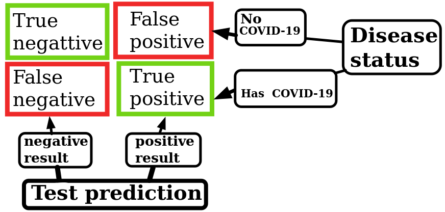

# Brief

In this post, I will introduce the fundamentals of classification. I will discuss testing and associated errors: true negative, true positive, false negative, and false positive. Additionally, we will look at how these can be neatly summarized in a confusion matrix.

## Setup

Most of us witnessed the COVID-19 pandemic and had a chance to undergo a COVID-19 test. One question that might arise is: how good were these tests?

To start off, imagine a population of people. Then we can sort them into two groups: those who have COVID (positive) and those who do not have COVID (negative) (see Figure 1). I will call this: sorting by disease status.


_Figure 1: dividing the population by disease status._

## Testing

However, once testing is introduced, there is a chance of miscategorizing people (see Figure 2). In general, miscategorization can occur in two ways. Either a person has COVID, and the test concludes that they do not. We call this case a false negative.

Alternatively, a person does not have COVID, but the test concludes that they do. We call this case a false positive.


_Figure 2: testing the population and categorizing as positive or negative test results._

Therefore, instead of two categories, as in sorting by disease status, we end up with four: true positive, true negative, false positive, and false negative. True or false indicates whether the disease status matches the test result. Meanwhile, positive or negative indicates the test result, **NOT** the disease status.

If the test categorizes a person correctly, they are true positive or true negative based on their disease status. However, if miscategorization occurs, the person is labeled as false positive or false negative according to the test result.

These four cases can be neatly summarized in a **confusion matrix** (see Figure 3).


_Figure 3: summarizing results of the test. Positive or negative is the result of the test. False or true indicates whether the test result aligns with disease status._

## Implementation of Confusion Matrix

To obtain the entries of the confusion matrix in Python, we can use the following commands:

```python
# Adds required command from sklearn library
from sklearn.metrics import confusion_matrix

# tn corresponds to True Negative, fp to False Positive, etc.
# disease_status and test_results are dataframes
tn, fp, fn, tp = confusion_matrix(disease_status, test_results).ravel()
```

## Conclusion
In this post, I introduced testing. In particular, the post discussed how testing introduces four categories, rather than just the two of having the disease or not. Additionally, a confusion matrix was introduced to summarize the testing categories: true negative, false positive, false negative, and true positive. In the next post on classification, we will look at the metrics that arise from the confusion matrix.
