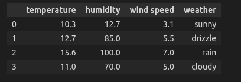

# Brief
What kinds of data are there? How can data be represented in Python and mathematically? Find out in this post!

## Organizing Data
Data are usually organized in tables (see Figure 1). Columns represent **variables**, and rows represent **observations**.

Imagine a thermometer, and say you want to predict the weather throughout the day. To start, you collect temperature data. Each hour during the day, you write down the temperature displayed on the thermometer.

In this case, the temperature is a variable and will be displayed at the top of the column. Subsequently, you would write readings from the thermometer right BELOW the label "temperature." These readings are separate observations and are identified with an index starting from 0 (see Figure 1).


_Figure 1: Example of collected data. Each column represents one variable: temperature, humidity, wind speed, weather. Meanwhile, each row represents an observation made by the observer at a specific time of the day._

## Kinds of Data
There are two types of data: **quantitative** and **qualitative**.

Quantitative data are numbers that represent real measurable quantities. This can be distance, temperature, sales in $, car speed, etc.

```python
# Observations of temperature measured throughout the day
temperature = [10, 12, 15.7, 18.9, 13, 10.5]
```

On the other hand, there is qualitative data. These could be drink types: "spirit," "beer," "soft drink," or satisfaction levels: "dissatisfied," "neutral," "satisfied." Qualitative data usually have two or more categories.

> Have you noticed something peculiar about the examples of qualitative data?
{: .prompt-tip }

There is a further distinction within qualitative data: **ordinal** and **nominal**. Ordinal data have a natural ordering, such as satisfaction ratings. In other words, the categories can be ORDERED, in this case from "dissatisfied" to "satisfied." Nominal data are just labels without natural ordering: "beer," "spirit," "soft drink."

## Representation of data with Python
To use Python for data analysis ``pandas`` package is usually used. Data are stored in **dataframes**. The following code creates a dataframe from observations, lables variables and displays first few rows of the dataframe.

```python
# Declaration that we are using pandas dataframe
import pandas as pd

# Defining variables that are measured 
labels = ["temperature", "humidity", "wind speed", "weather"]

# Making observations
observation_1 = [10.3, 12.7, 3.1, "sunny"]
observation_2 = [12.7, 85, 5.5, "drizzle"]
observation_3 = [15.6,100, 7,"rain"]
observation_4 = [11, 70, 5, "cloudy"]

#creating data frame with pandas package
df = pd.DataFrame([observation_1, observation_2, observation_3, observation_4], columns = labels)

#displays first few rows of the data frame
df.head()
```
If we want to select specific columns of the dataframe we can use the following command:
```python
data_selection = df[["temperature", "weather"]]
data_selection.head()
```

> ``df[["temperature"]]`` and ``df["temperature"]`` are not the same! First command returns dataframe and the second series. 
{: .prompt-danger }

## Mathematical representation
Mathematically, data are represented with **matrices**. Each entry of the matrix has a label consisting of two numbers, $(1,2)$. This would indicate the first row and second column of the matrix. However, with matrices, column names and row indices are NOT stated explicitly.

Figure 1 can be converted into the following matrix:

$$
\begin{bmatrix}
10.3 & 12.7 & 3.1 & \text{sunny}\\
12.7 & 85.0 & 5.5 & \text{drizzle}\\
15.6 & 100.0 & 7.0 & \text{rain}\\
11.0 & 70.0 & 5.0 & \text{drizzle}
\end{bmatrix}
$$

> **dataframes** label rows starting from 0 whereas **matrices** start labeling with 1. In this bolg I adopt the convention of dataframes, so matrices have a $(0,0)$ entry.
{: .prompt-warning }

## Conclusion

Data are organized in tables where columns represent **variables** such as "temperature" and "humidity," while rows are separate **observations**. Data can be **quantitative** or **qualitative**. Quantitative data are numbers, whereas qualitative data are categories. Qualitative data can be further divided into **ordinal** and **nominal**, where ordinal data have a natural ordering. Finally, data are represented with **dataframes** in Python and with **matrices** in mathematics.