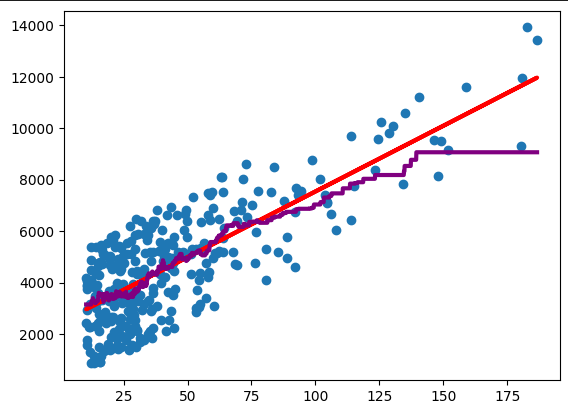

# Brief
In this article, we look at a regression problem which falls into supervised statistical learning. I will discuss two main approaches: parametric, and non-parametric approach. Finally, we compare the two.

# Regression problem
Regression problem, falls under supervised statistical learning and assumes **quantitative** dependent variable. For instance a temperature, sales, or velocity of molecules.

Hence, in the equation, 

$$Y= f(X) + \epsilon$$

dependent variable $Y$ is quantitative. There also is independent variables $X$, a statistical model $f(X)$, and $\epsilon$ an irreducible error. There are two main approaches to this problem and statistical learning in general.

_Figure 1: Simple linear regression in red and k-nearest-neighbor in purple._

## Parametric approach
Parametric approaches assume explicit form of $f(X)$. For instance $f(X) = \beta_0 + \beta_1 x + \beta_2 X^2$. Ususally, coefficents $\beta_0,\;\beta_1,\;\beta_2$ have to be estimated from data. 

The advantage of parametric approach is that usually it is **straightforward to interpret** coefficients of the model. Furthermore, there is an intuitive sense to the kind of relation between predictors, and dependent variables: linear, quadratic, etc. However, the disadvantage is that these models are quiet **inflexible**. For instance, a linear model would perform badly with data for quadratic model. 

### Simple linear regression
For simple linear regression assume that there is one independent and one dependent variable. In particular, the statistical model takes the form:

$$f(X) = \beta_0 + \beta_1 X,$$
where $\beta_0$ is called **intercept**, and $\beta_1$ is called **slope**. Both of these coefficients have to be estimated from data.

To that end, we minimize the **Residual Sums of Squares** given by:
$$\text{RSS} = \sum_{i=1}^n \epsilon_i^2 = \sum_{i=1}^n (y_i - f(X)_i)^2 = \sum_{i=1}^n (y_i - \beta_0 -\beta_1 X_i)^2,$$
assuming that datapoints are $(y_1, X_1),\; \ldots , (y_n, X_n)$. For minimization, we need to calculate
$$
\frac{d\;\text{RSS}}{d\;\beta_0} = 0,\\
\frac{d\;\text{RSS}}{d\;\beta_1} = 0,
$$
and rearrange for $\beta_0, \beta_1$. Fortunatelly, this is implemented in pyhton library ``scikit-learn``.
## Non-parametric approach 
Non parametric approach does not assume any parameters, or coefficient in the form of $f(X)$, rather the data are used more directly for predictions.

The advantage is that non-parametric methods are more felxible and can tackle a wider range of problems reasonably well. However, the disadvantege is that interpretability of the model suffers. In linear regression it is easy to interpret meaning of coeffficient. However, in non-parametric methods we do not have such a luxary. Despite this drawback non-parametric methods are **flexible** approaches that can tackle a wide range of problems.

### K-nearest-neighbor
For this model it is essential to first choose a **hyperparameter** $k$. Subsequently, the prediction value is average of k neighbors nearest to the value of interest $x_0$. In other words,

$$f(X)=\frac{1}{k}\sum_{i=1}^k X_i(x_0), $$

where $X_i$ are the observations lying closest to the value of interest $x_0$.

# Conclusion
Regression problem belongs to supervised statistical learning with quantitative independent variable. I discussed two ways for approaching regression problem: simple linear regression, and k-nearest-neighbor. Simple linear regression requires estimation of coefficients and so it falls to the category of parametric approaches. These are easier to interpret, but are les flexible. On the other hand, k-nearest-neighbor is non-parametric approach: more flexible, and less interpretable.