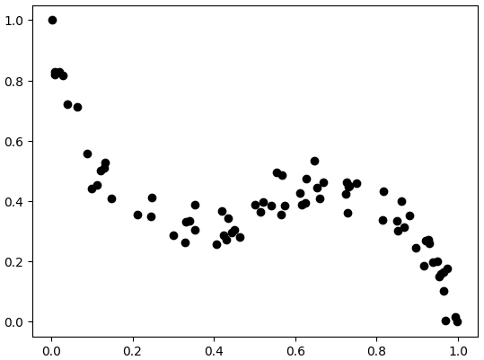
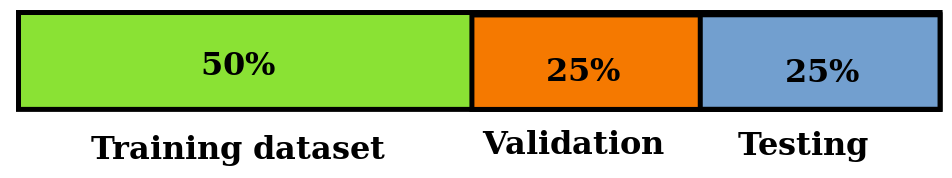
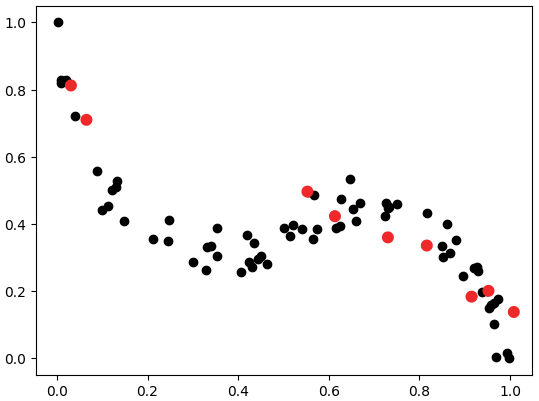

# Brief
We continue to explore supervised statistical learning and regression problem. In this article, I discuss different approaches to fit statistical models and why data are divided into multiple datasets: train-test split, train-test-validation split, cross-validation.

# Train-test split

We start with a regression problem and a dataset. A ``naive approach`` might be to use whole dataset for training. However, this approach runs into issue:

> **Question:** The model will perform really well on our dataset, but how do we gurantee that it generalizes to the real world?
{: .prompt-tip }

A sensible solution might be to intially split data into two groups: **training dataset**, and **testing dataset**.

### Training dataset
This will be use to train the statistical model. In the case of linear regression the datapoints are used to minimize the sums of squares. 

### Testing dataset
This is unseen data for the model and it should be never used to train a statistical model. It is kept separatelly, so the generalizability of statistical model can be tested.

At this point, we might ask what is the right split. As a rule of thumb, it is wise to retain most of the dataset for training and have a smaller portion for testing: 75% training, 25% testing.

In python, data can be split using the following code:

```python
from sklearn.model_selection import train_test_split

# Where X is a pandas datafram containing all predictors, and y is pandas series containing all dependent variables
# test_size is a float between 0 and 1 and determines the percentage of split.
# The function split data randomly into training and testing dataset
X_train, X_test, y_train, y_test = train_test_split(X, y, test_size=0.25)
```

# Train-test-validation split

> **Question:** Alright, I justified why we need to split data into training and testing dataset, but why would we split it to an additional **validation dataset**?
{: .prompt-tip }

The answer is that data are often messy and it is not straigt forward to choose a statistical model. 

_Figure 1: data generated from third order polynomial function._

Look at Figure 1 we could guess that we need polynomial fit of at least degree 3, but we might also consider polynomials of degrees 5, 7 etc. Which one is right? 

Perhaps, we could use testing dataset to pick the best model, but then we would not have a final test of generalizabilty of the model.

Hence, we create additional dataset called validation dataset. This dataset is used to pick the best performing statistical model among multiple candidates and it comprises of 25% of total data volume. Then the chosen model will be tested on the testing dataset.

Implementing this in python is straight forward and we might reuse function from before
```python
from sklearn.model_selection import train_test_split

# Split data in two halves
X_train, X_combined, y_train, y_combined = train_test_split(X, y, test_size=0.5)
# Split the second half into two more halves
X_test, X_validation, y_test, y_validation = train_test_split(X_combined, y_combined, test_size=0.5)
```

_Figure 2: summary of train-test-validation split_

# Cross-validation

Perfect! Now, we have a means of selecting right model and testing how it generalizes to unfamiliar dataset. What could go wrong? 

There is a small chance that the validation set will favor wrong type of model. 


_Figure 3: black dots represent whole dataset and red dots validation dataset._

In Figure 3, red dots are in validation dataset and they appear to favour linear model, meanwhile the datset has clearly a non-linear relation. In this case a linear model would be wrongly selected.

To prevent **overfitting to validation set**, we follow the procedure illustated in Figure 4:
- Split data into training and testing split.
- Partition training set into multiple validation set called **folds**.
- At each step choose one fold for validation and the rest of dataset for training.
- At each step calculate model's MSE on the validation set.
- Finally choose the model which has the lowest average MSE across folds of cross-validation and test it on testing set.


_Figure 4: cross-validation on different folds selected from training dataset at each step._

However, a drawback of cross-validation is that it is computationally expensive.

The function cross_validate can be used to calculate MSE of the model for each fold in cross-validation
```python
from sklearn.model_selection import cross_validate

# model is a choice of scikit-learn statistical model
# x_train, y_train are data from which validation folds are selected
# scoring is a metric which is used for model evaluation
# cv is number of folds
mse_score = cross_validate(model, x_train, y_train, scoring='neg_mean_squared_error', cv=10)

```
The function returns a dictionary of scores and training times. For more details see the [documentation](https://scikit-learn.org/stable/modules/generated/sklearn.model_selection.cross_validate.html).

# Conclusion

In this article, I described train-test split as a means of testing how well the model performs on an unfamiliar dataset. Then I introduced train-test-validation split which also selects ideal model for the datset. Finally, I discuss an issue of overfitting to validation dataset and how it can be adressed by cross-validation.