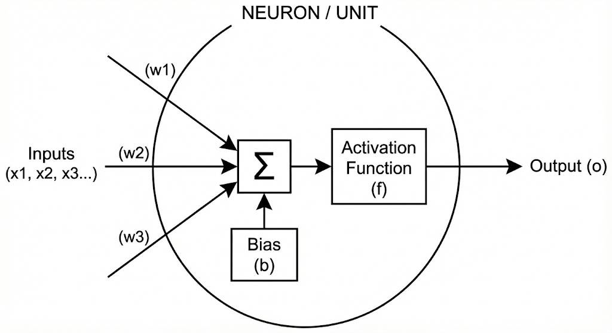
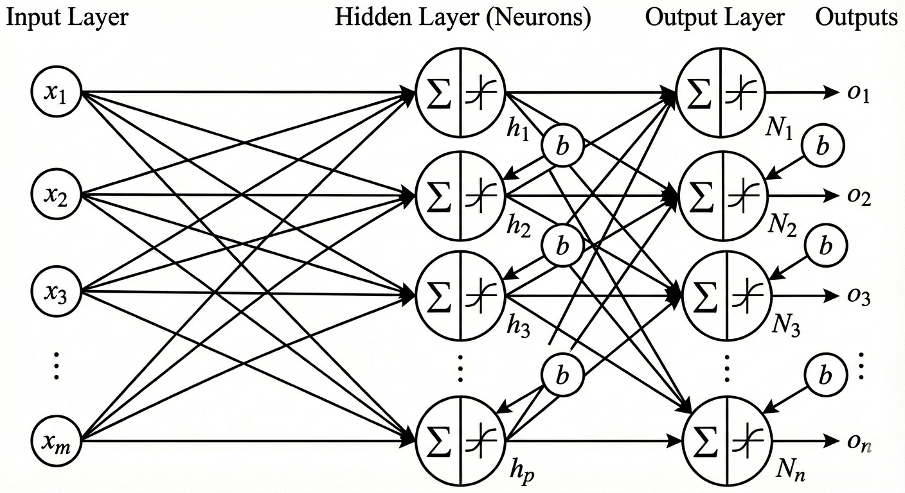

# Brief

# Architecture of Neural Network (NN)

Fundamentally, **Neural Network** is a vector function that takes input $x\in\mathbb{R}^{m}$ and produces output $o\in\mathbb{R}^{n}$ for $m,\; n \in \mathbb{N}$. Mathematicaly, we write 

$$
F_{\theta}: \mathbb{R}^{m} \to \mathbb{R}^n, \; x \mapsto o,
$$

where $\theta$ is a vector of parameters facilitating the transition.

The two numbers $m$ and $n$ describe the sizes of input and output. If the neural network is used to perdict height of participants, based on demographic data (education, income, home adress, sex) then $m=4$ and $n=1$. As we have 4 inputs and 1 output. $F_\theta$ is a grey box that transforms the inputs to the output.

In the following discussion we start by considering a single unit of Neural Networks called **Neuron**. These Neurons are then composed into a single layer of specified **width**, which is the number of neurones in the layer. Lastly we will consider a multi-layer neural network. The number of layers is called **depth** of neural network. 

## Single Unit (width 1, depth 1)

**Neuron** is the simplest unit of a neural network (Figure 1). It takes inputs $x_1, \dots, x_m$, transforms the inputs via weights $w_1, \dots, w_m$ and a bias $b$ to produce an output $o$. The final output $o$ is produced by activation function $f$. Mathematically, this can be written as

$$
o = f (w_i x_i + b),
$$

where Einstein's summation convention was employed. Here, $f: \mathbb{R} \to \mathbb{R}$ 

_Figure 1: Neuron with multiple inputs $x$, output $o$, bias $b$ and activation function $f$._

## Single Layer (width n, depth 1)

In order to produce multiple outputs, we must add multiple neurones into series (Figure 2).

_Figure 2: Single layer of neurones with inputs $x$, multiple outputs $o$, bias $b$ and activation function $f$._

The only difference in mathematical formulation from the single neuron case is the addion of the extra index accounting for each of the nuerones. Hence, the set of weights can be organize into matrix with entries $w_{\alpha i}$ for $i \in \{ 1, \dots, m \}$ and $\alpha \in \{ 1, \dots, n\}$. The generalized formulation becomes: 

$$
o_\alpha = f (w_{\alpha i} x_i + b_\alpha),
$$

where $f$ is applied element-wise for each index $\alpha$. 

## Multiple Layers (width (p, n), depth 2)

Lastly Neural networks often consist of multiple, not just one layer. In this section we illustrate how two leayers of neurones may be connected (Figure 3).

_Figure 3: Multiple layers of neurones with inputs $x$, multiple outputs $o$, bias $b$ and activation function $f$._

Assuming that first layer takes inputs $x_1, \dots , x_m$ and that there are $p$ neurones in the second layer, the first layer can be described as a function $F_1: \mathbb{R}^m \to \mathbb{R}^p, \; x \mapsto o$.

The second layer then has $p$ inputs, and $n$ outputs, hence it can be described as a function $F_2: \mathbb{R}^p \to \mathbb{R}^n, \; x \mapsto o$. Together these layers form a neural network by function composition:

$$
F_\theta = F_2 \circ F_1 : \mathbb{R}^m \to \mathbb{R}^n.
$$

In particular, we have

$$
o_\beta = F_2 ( f (w_{\alpha i} x_i + b_\alpha)) = f ( h_{\beta \alpha} f(w_{\alpha i} x_i + b_\alpha) + b_\beta).
$$

In the equation above, weights $w_{\alpha i}$ act as a transformation from $\mathbb{R}^m$ to $\mathbb{R}^p$. Similarly, weights $h_{\beta \alpha}$ transform intermediate inputs from $\mathbb{R}^p$ to $\mathbb{R}^n$. The above expression can be generalized to the neural network of an arbitrary depth.

# What is an activation function $f$?

# Evaluating performance

# Back propagation

# Conclusion
